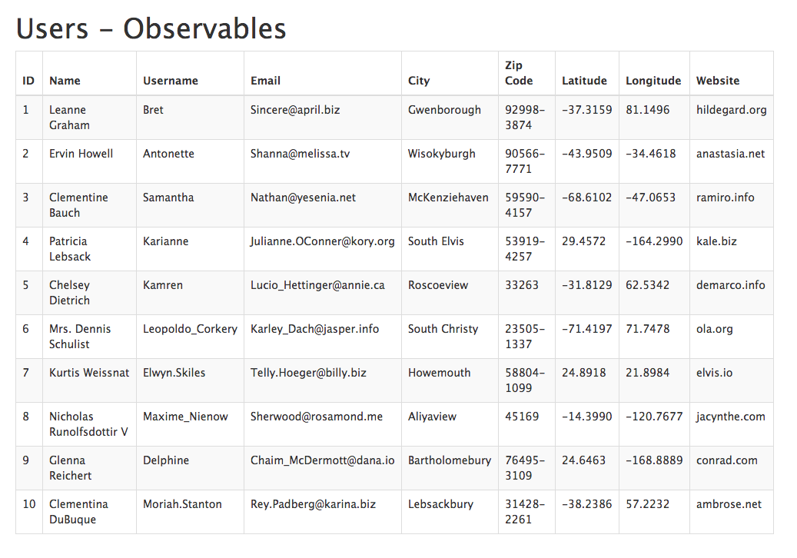

# Exercise
Create an Express application that will accept a **GET** request to route **/users** and send a response with a table of users (using any template engine of your choice)

* Use JSON data from URL (http://jsonplaceholder.typicode.com/users/)
* Fetch the data using node-fetch module in 3 different ways:
    1. Using Promises
    2. Using Reactive Programming (Observables)
    3. Using Async/Await
* Your application should run fluently behind any proxy without revealing the framework name to clients
* Your route should be case sensitive and strict
* Enable view caching for faster performance